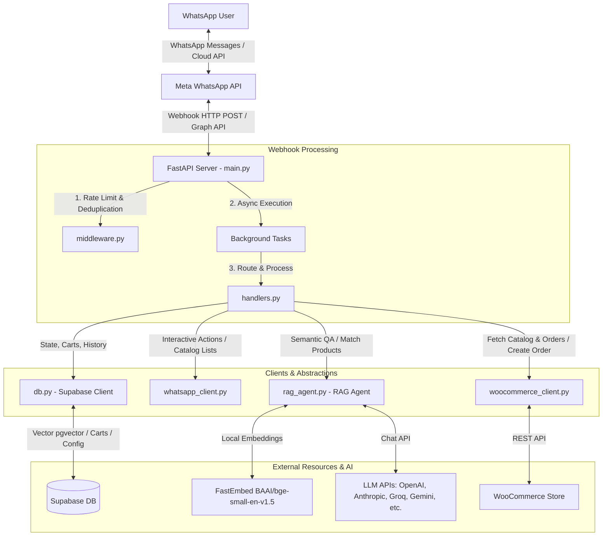

# Codebase Review: WooCommerce WhatsApp Chatbot with RAG AI

This codebase implements a production-ready WooCommerce WhatsApp Chatbot integrated with Meta's official WhatsApp Business Cloud API, a semantic search (RAG) agent powered by FastEmbed and Supabase (pgvector), and an interactive shop/cart flows system.

---

## 🏗️ System Architecture

Below is the conceptual architecture showing how messages flow from WhatsApp through the webhook server to WooCommerce, Supabase, and the LLM providers.

---

## 📦 File Responsibilities & Modules

| File | Purpose | Key Components & Logic |
| :--- | :--- | :--- |
| **[main.py](file:///h:/Repo/WooCom_WhatsApp_Bot/main.py)** | Application Entry Point & Webhooks | Sets up FastAPI server, lifespan events (remote configuration loading, clients startup), hourly abandoned cart checker, dashboard statistics API, and incoming Meta and WooCommerce Webhook handlers. |
| **[handlers.py](file:///h:/Repo/WooCom_WhatsApp_Bot/handlers.py)** | Interaction Routing & Commands | Orchestrates dialog states (e.g. main menu, category browser, cart viewer, checkout prompt). Contains routing tables (`ACTION_HANDLERS`, `PREFIX_HANDLERS`, `TEXT_COMMANDS`) to process text and interactive WhatsApp payloads. |
| **[rag_agent.py](file:///h:/Repo/WooCom_WhatsApp_Bot/rag_agent.py)** | Semantic Search & LLM Engine | Integrates local FastEmbed (`BAAI/bge-small-en-v1.5`) with cloud LLMs. Performs intent classification, extraction of budget ranges (min/max price), and handles fallback logic across multiple LLM endpoints. |
| **[db.py](file:///h:/Repo/WooCom_WhatsApp_Bot/db.py)** | Supabase Database Client | Manages active carts, caches orders placed, handles user status (idle/pending checkout/paused), updates chat history, and acts as the vector matcher backend via a custom RPC function. |
| **[whatsapp_client.py](file:///h:/Repo/WooCom_WhatsApp_Bot/whatsapp_client.py)** | WhatsApp Cloud API Wrapper | Low-level wrapper around the Meta WhatsApp API. Contains helper methods to send text, reply buttons (max 3), catalog lists (max 10), and image attachments. |
| **[woocommerce_client.py](file:///h:/Repo/WooCom_WhatsApp_Bot/woocommerce_client.py)** | WooCommerce API Wrapper | Integrates with WooCommerce REST API to fetch products, categories, search results, place COD (Cash-on-Delivery) orders, and list order history. |
| **[product_embeddings.py](file:///h:/Repo/WooCom_WhatsApp_Bot/product_embeddings.py)** | Standalone Sync & Vectorization | A utility script that fetches all products from WooCommerce, generates embeddings in batches of 8 (optimizing memory usage), and stores them in Supabase's `products` table. |
| **[middleware.py](file:///h:/Repo/WooCom_WhatsApp_Bot/middleware.py)** | Network & Session Filtering | Manages in-memory message deduplication (using Meta unique message IDs) and strict rate-limiting per phone number. |
| **[context.py](file:///h:/Repo/WooCom_WhatsApp_Bot/context.py)** | Shared Context Class | Implements `BotContext` dataclass containing instances of `db`, `wa`, `wc`, and `agent` clients to simplify injection in handlers. |
| **[utils.py](file:///h:/Repo/WooCom_WhatsApp_Bot/utils.py)** | Formatting Utilities | Common functions for normalizing phone numbers and cleaning raw WooCommerce HTML descriptions. |

---

## 🔄 Core Data Flows

### 1. Inbound WhatsApp Message Flow
1. **Receipt**: Meta sends a `POST` request to `/webhook` in [main.py](file:///h:/Repo/WooCom_WhatsApp_Bot/main.py).
2. **Deduplication & Rate-Limiting**: [middleware.py](file:///h:/Repo/WooCom_WhatsApp_Bot/middleware.py) checks if the message ID was recently processed or if the sender exceeds the threshold (max 5 requests per 10s).
3. **Response Acknowledgement**: The server immediately acknowledges with `200 OK` and delegates handling to FastAPI's background thread worker (`process_incoming_message` from [handlers.py](file:///h:/Repo/WooCom_WhatsApp_Bot/handlers.py)).
4. **State Lookup**: The database client checks user state in Supabase (`whatsapp_users` table):
   - **Paused (Human handoff)**: Ignore message (unless text is `resume`).
   - **Checkout Pending**: Forward raw text to address processing.
   - **Idle**: Inspect message contents:
     - If it contains an interactive action ID, it is routed via `route_action()`.
     - If it contains text, it checks the command lookup table (`route_text()`).
     - If no command matches, it triggers **AI Search / QA**.

### 2. Retrieval-Augmented Generation (RAG) Flow
When a query falls back to RAG in `handle_ai_search()`:
1. **Intent Analysis**: [rag_agent.py](file:///h:/Repo/WooCom_WhatsApp_Bot/rag_agent.py) sends the query to the primary LLM to classify intent (e.g. `product_search`, `support`, `small_talk`, `order_status`) and extract details (budget limits, search terms).
2. **Retrieval**: 
   - Generates a 384-dimensional query embedding via local `FastEmbed`.
   - Calls Supabase `match_products` RPC to find the top vector similarity matches in the database.
3. **Post-Filtering**: Evaluates the retrieved products against budget boundaries (min/max price). If filters leave zero products, it returns the closest alternatives.
4. **Synthesis**: Sends the curated context, conversation history, and user question to the LLM. The LLM generates a personalized sales pitch strictly following WhatsApp syntax (bold, bullet points, emoji).
5. **Interactive UI**: [handlers.py](file:///h:/Repo/WooCom_WhatsApp_Bot/handlers.py) displays the LLM response alongside a WhatsApp catalog List Message mapping the top matched products so the user can easily select them to view details or add to their cart.

---

## 💎 Codebase Strengths

1. **Non-blocking Webhook Design**: Immediately returns `200 OK` to Meta and processes messages in background tasks, ensuring the webhook never times out (which prevents duplicate re-deliveries from Meta).
2. **Memory Efficiency**: The product indexing sync runs in custom small batches of 8, enabling vector embeddings generation on machines with low memory footprints.
3. **Resilient LLM Integration**: The LLM engine features an automatic exponential backoff retry mechanism (up to 3 times) and a structured fallback registry (`openrouter`, `groq`, `grok`, `gemini`, `openai`, `anthropic`) to bypass API downtime or limit issues.
4. **Local Embedding Vectorization**: Using `FastEmbed` locally avoids third-party costs and latency of cloud embedding models.
5. **Comprehensive Interactive Dialogs**: Utilizes WhatsApp list and button reply components, providing a cohesive app experience compared to text-only bots.

---

## 🛠️ Areas of Technical Debt & Recommendations

Here are a few areas that could be enhanced to improve performance, scalability, and security:

*   **In-Memory Middleware State**: Deduplication and rate-limiting buckets are stored in local variables in [middleware.py](file:///h:/Repo/WooCom_WhatsApp_Bot/middleware.py). If the app restarts, scales horizontally, or runs on multi-worker servers (like standard Uvicorn configs), this state will desynchronize.
    *   *Recommendation*: Move rate-limiting and deduplication keys to a Redis cache or a shared Postgres lookup.
*   **Thread Safety in Database Client**: The `DatabaseClient` executes synchronous supabase-py operations wrapped in `asyncio.to_thread()`. While functional, some operations would benefit from natively async db clients or connection pools.
*   **Vector Search Precision**: Embedding products combines name, price, description, categories, and tags into a single unstructured string in `prepare_product_search_text()`. In large catalogs, this might dilute specific product names.
    *   *Recommendation*: Implement a hybrid search pattern combining full-text search (BM25) on exact tokens (e.g., product names or SKUs) with semantic vector search.
*   **No Webhook Signature Verification**: FastAPI does not verify Meta's webhook header signatures (`X-Hub-Signature-256`), meaning external endpoints could theoretically spoof webhook payloads.
    *   *Recommendation*: Implement SHA256 signature verification middleware using the app's secret token.
