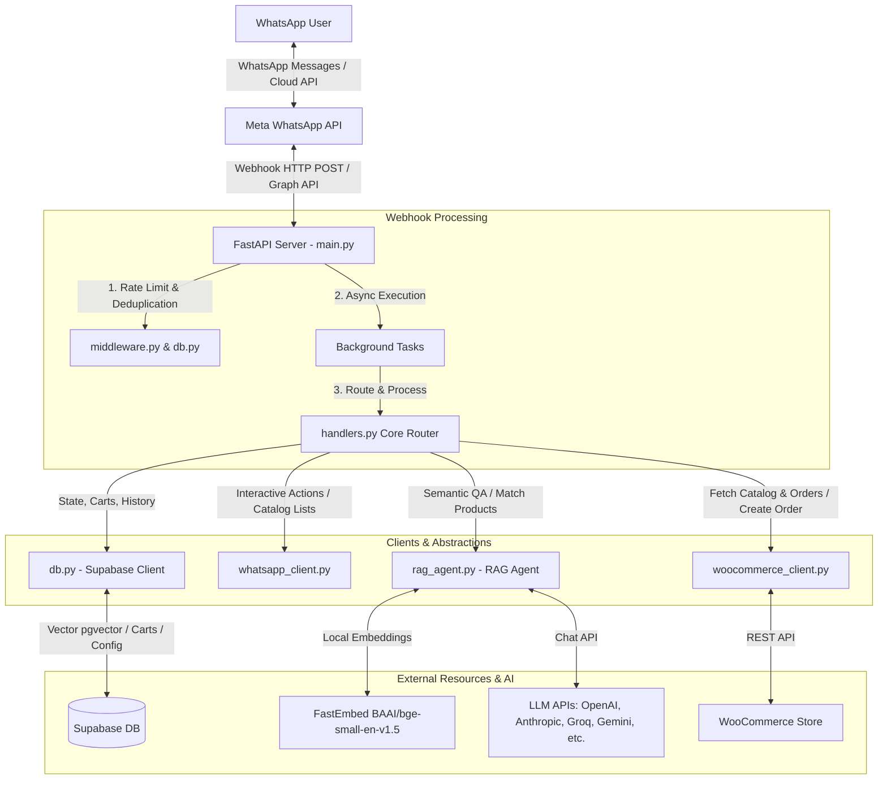

# Codebase Review: WooCommerce WhatsApp Chatbot with RAG AI

This codebase implements a production-ready WooCommerce WhatsApp Chatbot integrated with Meta's official WhatsApp Business Cloud API, a semantic search (RAG) agent powered by FastEmbed and Supabase (pgvector), and an interactive shop/cart flows system.

---

## 🏗️ System Architecture

Below is the conceptual architecture showing how messages flow from WhatsApp through the webhook server to WooCommerce, Supabase, and the LLM providers.

```mermaid
graph TD
    User[WhatsApp User] <-->|WhatsApp Messages / Cloud API| MetaAPI[Meta WhatsApp API]
    MetaAPI <-->|Webhook HTTP POST / Graph API| WebServer[FastAPI Server - main.py]
    
    subgraph Webhook Processing
        WebServer -->|1. Rate Limit & Deduplication| Middleware[middleware.py & db.py]
        WebServer -->|2. Async Execution| BGTasks[Background Tasks]
        BGTasks -->|3. Route & Process| Handlers[handlers.py Core Router]
    end
    
    subgraph Clients & Abstractions
        Handlers -->|State, Carts, History| DB[db.py - Supabase Client]
        Handlers -->|Interactive Actions / Catalog Lists| WA[whatsapp_client.py]
        Handlers -->|Fetch Catalog & Orders / Create Order| WC[woocommerce_client.py]
        Handlers -->|Semantic QA / Match Products| RAG[rag_agent.py - RAG Agent]
    end
    
    subgraph External Resources & AI
        DB <-->|Vector pgvector / Carts / Config| Supabase[(Supabase DB)]
        RAG <-->|Local Embeddings| FastEmbed[FastEmbed BAAI/bge-small-en-v1.5]
        RAG <-->|Chat API| LLM[LLM APIs: OpenAI, Anthropic, Groq, Gemini, etc.]
        WC <-->|REST API| WooCommerce[WooCommerce Store]
    end
```

---

## 📦 File Responsibilities & Modules

| File | Purpose | Key Components & Logic |
| :--- | :--- | :--- |
| **[main.py](file:///h:/Repo/WooCom_WhatsApp_Bot/main.py)** | Application Entry Point & Webhooks | Sets up FastAPI server, lifespan events, handles incoming Meta and WooCommerce Webhook handlers with HMAC-SHA256 verification. |
| **[handlers.py](file:///h:/Repo/WooCom_WhatsApp_Bot/handlers.py)** | Core Router | Central dispatcher that routes incoming text and interactive actions to modular handlers. |
| **[shopping_handlers.py](file:///h:/Repo/WooCom_WhatsApp_Bot/shopping_handlers.py)** | Shopping Flows | Browsing categories, searching products, viewing product details and recommendations. |
| **[cart_handlers.py](file:///h:/Repo/WooCom_WhatsApp_Bot/cart_handlers.py)** | Cart & Checkout | Adding to cart, viewing cart, checkout, payment processing. |
| **[support_handlers.py](file:///h:/Repo/WooCom_WhatsApp_Bot/support_handlers.py)** | Support | Human hand-off and bot resumption. |
| **[account_handlers.py](file:///h:/Repo/WooCom_WhatsApp_Bot/account_handlers.py)** | Account | Order history, cancelation, language settings. |
| **[rag_agent.py](file:///h:/Repo/WooCom_WhatsApp_Bot/rag_agent.py)** | Semantic Search & LLM Engine | Integrates local FastEmbed with cloud LLMs. Performs intent classification and product matching. |
| **[db.py](file:///h:/Repo/WooCom_WhatsApp_Bot/db.py)** | Supabase Database Client | Manages active carts, caches orders, state, and rate limits/dedup. |
| **[whatsapp_client.py](file:///h:/Repo/WooCom_WhatsApp_Bot/whatsapp_client.py)** | WhatsApp Cloud API Wrapper | Low-level wrapper around the Meta WhatsApp API. |
| **[woocommerce_client.py](file:///h:/Repo/WooCom_WhatsApp_Bot/woocommerce_client.py)** | WooCommerce API Wrapper | Integrates with WooCommerce REST API. |
| **[middleware.py](file:///h:/Repo/WooCom_WhatsApp_Bot/middleware.py)** | Network & Session Filtering | Manages fast in-memory message deduplication. |

---

## 🔄 Core Data Flows

### 1. Inbound WhatsApp Message Flow
1. **Receipt**: Meta sends a `POST` request to `/webhook` in `main.py`.
2. **Security**: HMAC-SHA256 signature is verified against the App Secret.
3. **Deduplication & Rate-Limiting**: The fast in-memory set handles immediate dedup, followed by persistent Supabase checks in `db.py`.
4. **Response Acknowledgement**: The server immediately acknowledges with `200 OK` and delegates handling to background threads.
5. **State Lookup**: Checks user state (Idle, Pending Checkout, Paused) and delegates to `handlers.py` router.

### 2. Retrieval-Augmented Generation (RAG) Flow
When a query falls back to RAG in `handle_ai_search()`:
1. **Intent Analysis**: `rag_agent.py` sends the query to classify intent.
2. **Retrieval**: Generates an embedding via `FastEmbed` and calls Supabase `match_products`.
3. **Synthesis & Interactive UI**: Generates a WhatsApp-native response and displays the catalog List Message.

---

## 💎 Codebase Strengths

1. **Non-blocking Webhook Design**: Immediately returns `200 OK` to prevent duplicate re-deliveries from Meta.
2. **Memory Efficiency**: Custom small batches of 8 for vector embeddings.
3. **Resilient LLM Integration**: Exponential backoff retry mechanism and a structured fallback registry.
4. **Modular Architecture**: Handlers are broken down into logical domains (Shopping, Cart, Support, Account).
5. **Scalable Security & Limits**: HMAC signature verification secures the endpoints, while Supabase persistent rate-limiting allows the bot to scale horizontally across multiple workers.
